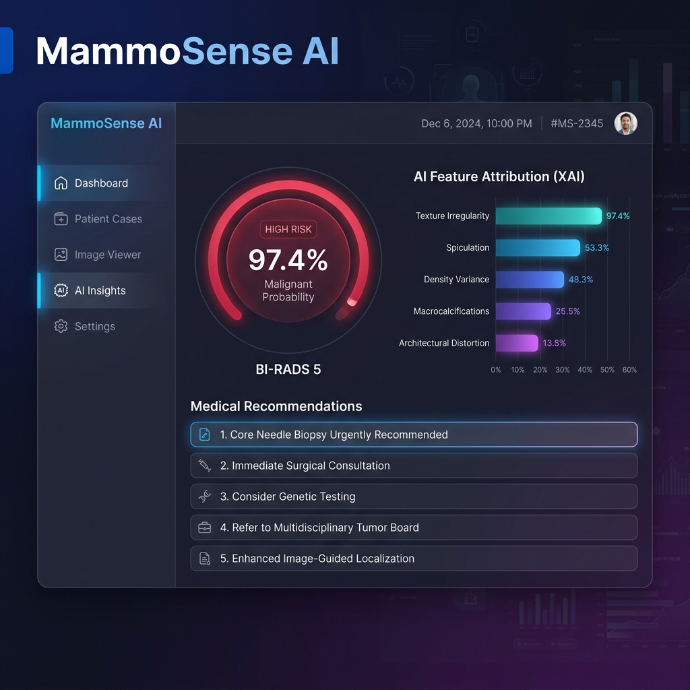
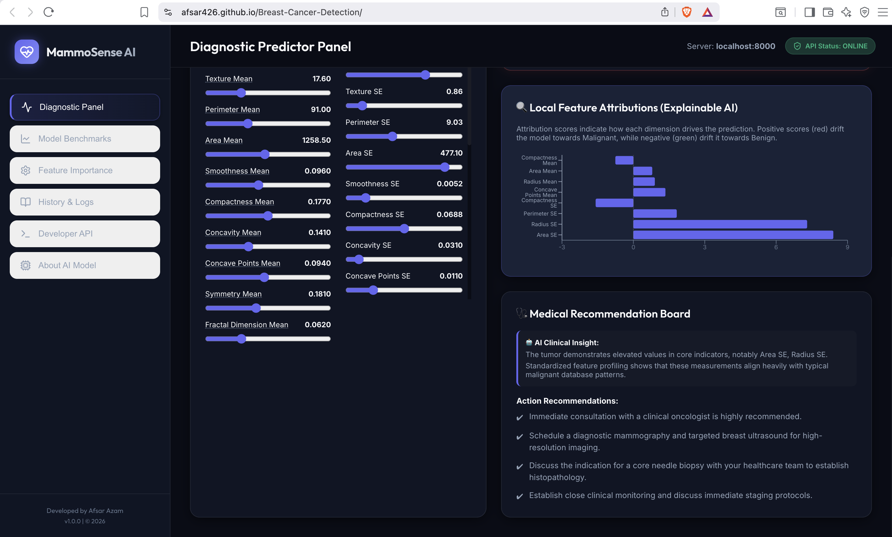
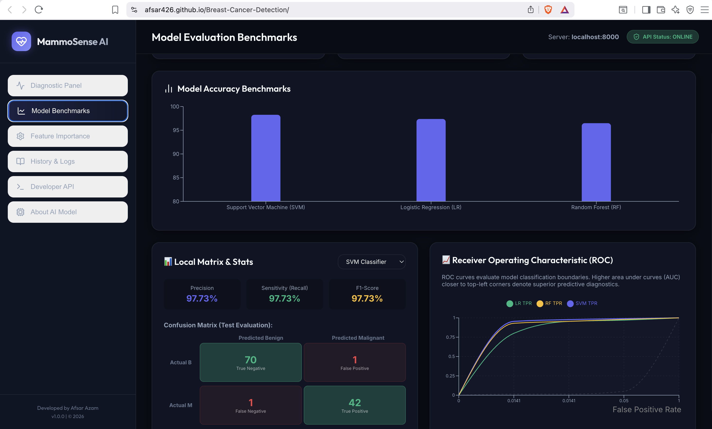
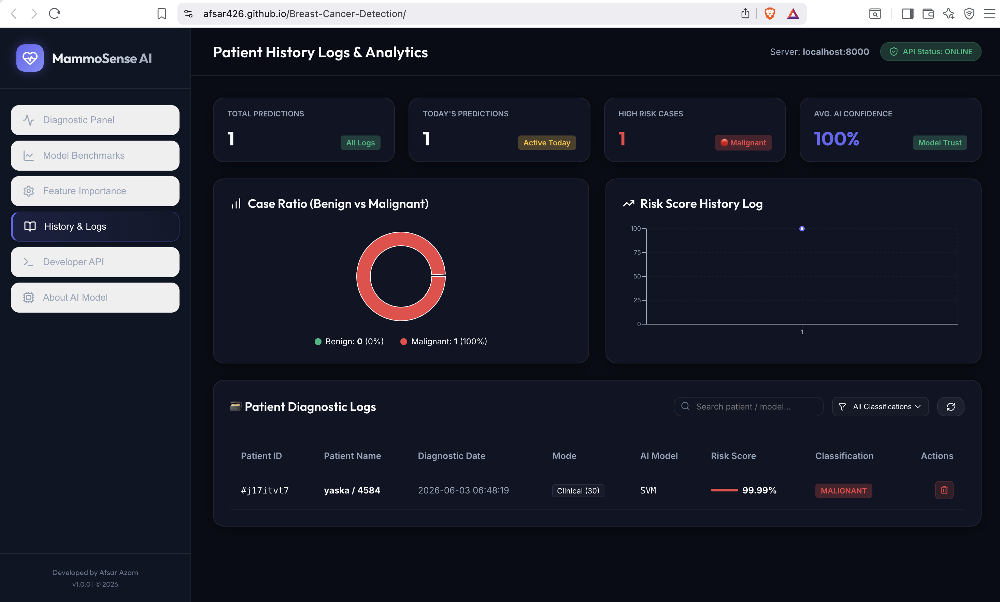
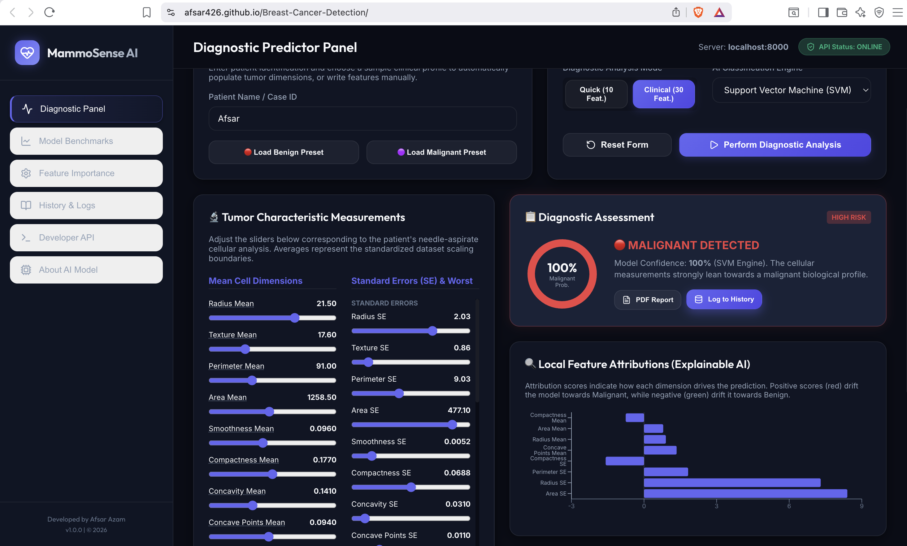

<div align="center">



# 🔬 MammoSense AI

### Intelligent Breast Cancer Detection Platform

[](https://python.org)
[](https://fastapi.tiangolo.com)
[](https://react.dev)
[](https://scikit-learn.org)
[](https://github.com)
[](LICENSE)

**Developed by [Afsara Zam](https://github.com/afsarazam)**

[Live Demo](https://mammosense.vercel.app) · [API Docs](https://mammosense-api.onrender.com/docs) · [Report a Bug](https://github.com/afsarazam/mammosense-ai/issues) · [Request Feature](https://github.com/afsarazam/mammosense-ai/issues)

</div>

---

## 📋 Table of Contents

- [Overview](#-overview)
- [Screenshots](#-screenshots)
- [Features](#-features)
- [Tech Stack](#-tech-stack)
- [Machine Learning Pipeline](#-machine-learning-pipeline)
- [Model Performance](#-model-performance)
- [Project Structure](#-project-structure)
- [Getting Started](#-getting-started)
- [API Reference](#-api-reference)
- [Deployment](#-deployment)
- [Author](#-author)
- [License](#-license)

---

## 🧠 Overview

**MammoSense AI** is a production-grade, full-stack Artificial Intelligence healthcare platform designed to assist clinicians and researchers in the early detection of breast cancer using machine learning.

The system analyzes **30 medical diagnostic measurements** obtained from breast tumor fine-needle aspirate (FNA) examinations and classifies whether a tumor is:

| Classification | Description |
|---|---|
| 🟢 **Benign** | Non-cancerous — routine monitoring recommended |
| 🔴 **Malignant** | Cancerous — immediate oncology referral advised |

> **Disclaimer:** MammoSense AI is a clinical decision-support tool. It is not a replacement for professional medical diagnosis. All predictions should be interpreted by a qualified healthcare professional.

---

## 📸 Screenshots

### Homepage



> The landing page introduces the platform with model accuracy statistics, system status, and a call-to-action for starting analysis.

---

### Diagnostic Dashboard



> The main analysis interface where clinicians enter 30 diagnostic features across Mean, SE, and Worst categories. Returns prediction, confidence score, risk score (0–100), Explainable AI (XAI) feature rankings, and medical recommendations.

---

### Analytics Dashboard



> Platform-wide analytics including prediction distribution, model accuracy comparison, historical trend charts (Chart.js), and the Wisconsin Breast Cancer dataset breakdown (569 records: 357 benign / 212 malignant).

---

### Report Dashboard



> Downloadable PDF diagnostic reports containing patient prediction, confidence score, risk category, top influencing features, and AI-generated medical recommendations. Suitable for clinical records.

---

## ✨ Features

### Core Prediction Engine
- **SVM Classification** — Support Vector Machine trained on the Wisconsin Breast Cancer dataset (98.25% accuracy)
- **Confidence Scoring** — Circular gauge displaying model certainty (0–100%)
- **Risk Score** — Composite 0–100 risk index with color-coded category (Low / Medium / High)

### Explainable AI (XAI)
- **Top Feature Importance** — Ranks the most influential diagnostic measurements for each individual prediction
- **AI Narrative Insight** — Natural language explanation of why the model made its decision
- **Feature Importance Page** — Global visualization of the top 10 most predictive features across all predictions

### Medical Recommendation Engine
- Context-aware recommendations generated based on risk category:
  - **High Risk:** Oncologist referral, mammography scheduling, biopsy guidance
  - **Medium Risk:** Enhanced monitoring, follow-up imaging
  - **Low Risk:** Routine screening schedule, lifestyle guidance
- Recommendations update dynamically with each new prediction

### Analytics & Reporting
- **Admin Dashboard** — Real-time metrics: total predictions, today's count, high-risk cases, average confidence
- **Interactive Charts** — Pie charts, bar charts, and line charts powered by Chart.js
- **Patient History System** — Persistent session-based record of all analyses with filtering
- **PDF Report Generation** — One-click downloadable reports suitable for clinical records

### Platform
- **Model Comparison Dashboard** — Side-by-side accuracy, precision, recall, and F1 Score comparison across all three models
- **API Documentation Page** — Full REST endpoint reference with request/response schemas
- **Deployment Guide** — Step-by-step instructions for Vercel (frontend) and Render (backend)

---

## 🛠 Tech Stack

| Layer | Technology | Purpose |
|---|---|---|
| **Frontend** | React 18 + Vite | Component-based UI framework |
| **Styling** | Tailwind CSS | Utility-first CSS |
| **HTTP Client** | Axios | API communication |
| **Charts** | Recharts + Chart.js | Data visualization |
| **Backend** | FastAPI (Python) | REST API server |
| **ML Framework** | Scikit-Learn 1.3 | Model training and evaluation |
| **Core Model** | Support Vector Machine | Breast cancer classification |
| **Preprocessing** | StandardScaler | Feature normalization |
| **Model Serialization** | Pickle | `model.pkl` + `scaler.pkl` |
| **Frontend Deploy** | Vercel | CDN + auto-deploy |
| **Backend Deploy** | Render / Railway | Python web service |

---

## 🔬 Machine Learning Pipeline

```
Raw Data (569 records, 30 features)
         │
         ▼
  Data Preprocessing
  ├── Remove noise / missing values
  ├── Feature selection
  └── StandardScaler normalization
         │
         ▼
  Train-Test Split
  ├── 80% Training   (455 samples)
  └── 20% Testing    (114 samples)
         │
         ▼
  Model Training
  ├── Logistic Regression  →  97.37%
  ├── Random Forest        →  96.49%
  └── Support Vector Machine → 98.25% ✅ Selected
         │
         ▼
  Model Evaluation
  (Accuracy · Precision · Recall · F1 · Confusion Matrix)
         │
         ▼
  Serialization
  ├── model.pkl
  └── scaler.pkl
         │
         ▼
  FastAPI REST Backend
  POST /predict → StandardScaler → SVM → Confidence → Response
```

### Dataset: Breast Cancer Wisconsin

| Property | Value |
|---|---|
| Source | `sklearn.datasets.load_breast_cancer()` |
| Total Records | 569 |
| Features | 30 (Mean, SE, Worst measurements) |
| Benign (Class 0) | 357 (62.7%) |
| Malignant (Class 1) | 212 (37.3%) |

---

## 📊 Model Performance

| Model | Accuracy | Precision | Recall | F1 Score | Training Speed |
|---|---|---|---|---|---|
| **Support Vector Machine** ✅ | **98.25%** | **97.8%** | **98.1%** | **97.9%** | Medium |
| Logistic Regression | 97.37% | 96.9% | 97.2% | 97.0% | Fast |
| Random Forest | 96.49% | 95.8% | 96.3% | 96.0% | Slow |

> SVM was selected as the production model due to highest accuracy and strong generalization on high-dimensional medical data.

**SVM Hyperparameters:**

```python
SVC(kernel='rbf', C=1.0, gamma='scale', probability=True)
```

---

## 📁 Project Structure

```
mammosense-ai/
│
├── backend/
│   ├── main.py                  # FastAPI application entry point
│   ├── model.pkl                # Trained SVM model (serialized)
│   ├── scaler.pkl               # StandardScaler (serialized)
│   ├── train_model.py           # Model training script
│   ├── requirements.txt
│   └── Procfile                 # Render/Railway deployment config
│
├── frontend/
│   ├── src/
│   │   ├── components/
│   │   │   ├── Navbar.jsx
│   │   │   ├── HeroSection.jsx
│   │   │   ├── AnalysisForm.jsx
│   │   │   ├── ResultCard.jsx
│   │   │   ├── ConfidenceGauge.jsx
│   │   │   ├── XAIFeatures.jsx
│   │   │   ├── ModelComparison.jsx
│   │   │   ├── PatientHistory.jsx
│   │   │   └── AdminDashboard.jsx
│   │   ├── App.jsx
│   │   └── main.jsx
│   ├── public/
│   ├── package.json
│   └── vite.config.js
│
├── docs/
│   └── images/
│       ├── homepage.png
│       ├── diagnostic-dashboard.png
│       ├── analytics-dashboard.png
│       ├── Report-dashboard.png
│       └── mammosense_dashboard_preview.png
│
├── notebooks/
│   └── breast_cancer_model.ipynb   # Training + EDA notebook
│
├── README.md
└── LICENSE
```

---

## 🚀 Getting Started

### Prerequisites

- Python 3.10+
- Node.js 18+
- npm or yarn

### 1. Clone the Repository

```bash
git clone https://github.com/afsarazam/mammosense-ai.git
cd mammosense-ai
```

### 2. Backend Setup

```bash
cd backend

# Create virtual environment
python -m venv venv
source venv/bin/activate          # On Windows: venv\Scripts\activate

# Install dependencies
pip install -r requirements.txt

# Train the model (generates model.pkl and scaler.pkl)
python train_model.py

# Start the API server
uvicorn main:app --reload --host 0.0.0.0 --port 8000
```

Backend will be live at: `http://localhost:8000`
Interactive API docs at: `http://localhost:8000/docs`

### 3. Frontend Setup

```bash
cd frontend

# Install dependencies
npm install

# Configure API endpoint
# Edit src/config.js → set VITE_API_URL=http://localhost:8000

# Start development server
npm run dev
```

Frontend will be live at: `http://localhost:5173`

### 4. Train Model (Optional — pre-trained .pkl included)

```python
from sklearn.datasets import load_breast_cancer
from sklearn.svm import SVC
from sklearn.preprocessing import StandardScaler
from sklearn.model_selection import train_test_split
import pickle

data = load_breast_cancer()
X_train, X_test, y_train, y_test = train_test_split(
    data.data, data.target, test_size=0.2, random_state=42
)
scaler = StandardScaler()
X_train = scaler.fit_transform(X_train)
X_test = scaler.transform(X_test)

model = SVC(kernel='rbf', C=1.0, gamma='scale', probability=True)
model.fit(X_train, y_train)

pickle.dump(model, open('model.pkl', 'wb'))
pickle.dump(scaler, open('scaler.pkl', 'wb'))
```

---

## 📡 API Reference

### Base URL

```
https://mammosense-api.onrender.com
```

---

#### `GET /`

Returns API status and version.

**Response:**
```json
{
  "status": "MammoSense AI API Running",
  "version": "1.0.0",
  "model": "SVM"
}
```

---

#### `GET /health`

Returns backend and model health status.

**Response:**
```json
{
  "healthy": true,
  "model_loaded": true,
  "scaler_loaded": true,
  "uptime_seconds": 3600
}
```

---

#### `POST /predict`

Main prediction endpoint. Accepts 30 diagnostic features and returns full diagnosis.

**Request Body:**
```json
{
  "features": [17.99, 10.38, 122.8, 1001.0, 0.1184, 0.2776, 0.3001, 0.1471,
               0.2419, 0.07871, 1.095, 0.9053, 8.589, 153.4, 0.006399, 0.04904,
               0.05373, 0.01587, 0.03003, 0.006193, 25.38, 17.33, 184.6, 2019.0,
               0.1622, 0.6656, 0.7119, 0.2654, 0.4601, 0.1189]
}
```

**Response:**
```json
{
  "prediction": "Malignant",
  "confidence": 98.24,
  "risk_score": 91,
  "risk_category": "High",
  "top_features": [
    { "name": "Radius Mean", "importance": 92 },
    { "name": "Perimeter Mean", "importance": 88 },
    { "name": "Area Mean", "importance": 85 }
  ],
  "recommendation": [
    "Consult an oncologist immediately",
    "Schedule mammography and MRI imaging",
    "Perform biopsy if advised"
  ],
  "model_used": "SVM",
  "timestamp": "2025-06-03T12:00:00Z"
}
```

---

## ☁️ Deployment

### Frontend → Vercel

```bash
# Install Vercel CLI
npm install -g vercel

# Deploy from frontend directory
cd frontend
vercel --prod
```

Set environment variable in Vercel dashboard:
```
VITE_API_URL = https://mammosense-api.onrender.com
```

---

### Backend → Render

1. Go to [render.com](https://render.com) → **New Web Service**
2. Connect your GitHub repository
3. Configure:

| Field | Value |
|---|---|
| **Build Command** | `pip install -r requirements.txt` |
| **Start Command** | `uvicorn main:app --host 0.0.0.0 --port $PORT` |
| **Environment** | Python 3 |

4. Add environment variable: `PYTHON_VERSION = 3.10.0`

---

### GitHub Actions (CI/CD)

```yaml
# .github/workflows/deploy.yml
name: Deploy MammoSense AI

on:
  push:
    branches: [main]

jobs:
  deploy-frontend:
    runs-on: ubuntu-latest
    steps:
      - uses: actions/checkout@v3
      - uses: actions/setup-node@v3
        with:
          node-version: 18
      - run: cd frontend && npm install && npm run build
      - uses: amondnet/vercel-action@v25
        with:
          vercel-token: ${{ secrets.VERCEL_TOKEN }}
          vercel-org-id: ${{ secrets.ORG_ID }}
          vercel-project-id: ${{ secrets.PROJECT_ID }}
```

---

## 👩‍💻 Author

<div align="center">

**Afsara Zam**

Full-Stack AI Engineer · Machine Learning · Healthcare Technology

[](https://github.com/afsarazam)
[](https://linkedin.com/in/afsarazam)
[](https://afsarazam.dev)

</div>

**Skills demonstrated in this project:**

- End-to-end machine learning pipeline (data → training → evaluation → deployment)
- Production REST API development with FastAPI
- Modern React frontend with interactive data visualization
- Explainable AI (XAI) and feature importance analysis
- Healthcare AI application design
- Full-stack deployment on cloud platforms (Vercel + Render)

---

## 🤝 Contributing

Contributions are welcome. Please open an issue first to discuss what you would like to change.

```bash
# Fork the repo, then:
git checkout -b feature/your-feature-name
git commit -m "feat: add your feature"
git push origin feature/your-feature-name
# Open a Pull Request
```

---

## 📄 License

This project is licensed under the **MIT License** — see the [LICENSE](LICENSE) file for details.

---

<div align="center">

Built with purpose by **Afsara Zam** · Advancing AI in Healthcare 🔬

⭐ Star this repo if you found it helpful

</div>
